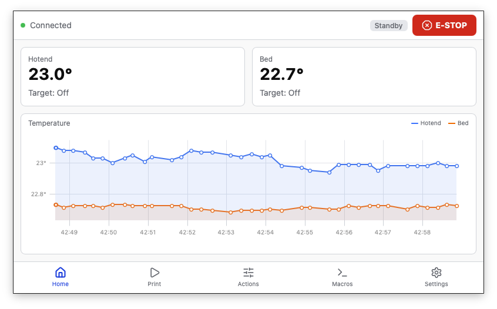

# Klipper Touch

A modern touchscreen UI for Klipper 3D printers.


<!-- TODO: Add screenshot -->

---

## Features

- **Dashboard** -- Live hotend and bed temperatures with real-time uPlot charts, printer status at a glance
- **Print control** -- File browser with GCode thumbnails, start/pause/cancel, live progress with ETA
- **Movement** -- XY jog pad with Z controls, configurable step sizes and speeds, axis inversion
- **Fan control** -- Auto-discovers all fans from Klipper config; sliders for controllable fans, read-only display for automatic fans
- **Extruder** -- Temperature presets, extrude/retract, filament load/unload, flow rate display
- **Bed mesh** -- Interactive 3D surface visualizer with touch Urotation, Z exaggeration slider, color-coded height map
- **Macros** -- Auto-discovers macros from Klipper, parses parameters with defaults, confirmation dialogs
- **Settings** -- Theme switching (light/dark), Moonraker connection, network info
- **Emergency stop** -- Always accessible from the status bar

## Quick Install

On your Raspberry Pi (ARM64, Debian/Ubuntu), run:

```bash
curl -fsSL https://raw.githubusercontent.com/staticfx/klipper-touch/master/scripts/install.sh | bash
```

Or with options:

The installer will:

1. Check system compatibility (ARM64, Debian/Ubuntu)
2. Install system dependencies (WebKitGTK, Cage, fonts)
3. Download the latest `.deb` release from GitHub
4. Create a default config at `~/.config/klipper-touch/config.toml`
5. Install and start a systemd service
6. Optionally disable KlipperScreen if it is running

## Development

### Prerequisites

- [Bun](https://bun.sh/) (JavaScript runtime and package manager)
- [Rust](https://rustup.rs/) toolchain (stable)
- System libraries for Tauri v2: `libwebkit2gtk-4.1-dev`, `libgtk-3-dev`, `libayatana-appindicator3-dev`

### Setup

```bash
bun install
```

### Run in development mode

```bash
bun run tauri dev
```

This starts the Vite dev server with hot reload and opens the Tauri window. The default dev config points to Moonraker at `http://192.168.178.35:7125` -- edit `config.dev.toml` to match your printer.

### Lint

```bash
bun run lint
```

## Building

Build a release binary and `.deb` package:

```bash
bun run tauri build
```

Outputs are placed in `src-tauri/target/release/bundle/`:

- `deb/klipper-touch_<version>_<arch>.deb` -- Debian package for direct installation
- The release binary is at `src-tauri/target/release/klipper-touch`

### Cross-compiling for Raspberry Pi

If building on a non-ARM host, set up a cross-compilation toolchain for `aarch64-unknown-linux-gnu` or `armv7-unknown-linux-gnueabihf` and pass the appropriate `--target` flag to `cargo`.

## Configuration

Configuration lives at `~/.config/klipper-touch/config.toml`. An example is provided at `config/klipper-touch.example.toml`.

```toml
# Moonraker URL (required)
moonraker_url = "http://localhost:7125"

# Theme: "light" or "dark"
theme = "dark"

# Custom macros (optional)
[[macros]]
name = "QGL"
gcode = "QUAD_GANTRY_LEVEL"
color = "#3b82f6"
confirm = true

[[macros]]
name = "Bed Mesh"
gcode = "BED_MESH_CALIBRATE"
color = "#8b5cf6"
confirm = false
```

| Key | Description | Default |
|-----|-------------|---------|
| `moonraker_url` | Full URL to your Moonraker instance | `http://localhost:7125` |
| `theme` | UI theme (`"light"` or `"dark"`) | `"light"` |
| `[[macros]]` | Array of custom macro buttons | none |

Each macro entry supports:

| Key | Description |
|-----|-------------|
| `name` | Display name on the button |
| `gcode` | GCode to send (supports `\n` for multi-line) |
| `color` | Hex color for the button |
| `confirm` | Whether to show a confirmation dialog before executing |

## Systemd Service

The service file runs Klipper Touch inside a Cage Wayland kiosk:

```
ExecStart=/usr/bin/cage -s -- /opt/klipper-touch/klipper-touch
```

Manage it with:

```bash
sudo systemctl start klipper-touch@$USER
sudo systemctl stop klipper-touch@$USER
sudo systemctl status klipper-touch@$USER
journalctl -u klipper-touch@$USER -f   # view logs
```

## License

MIT
